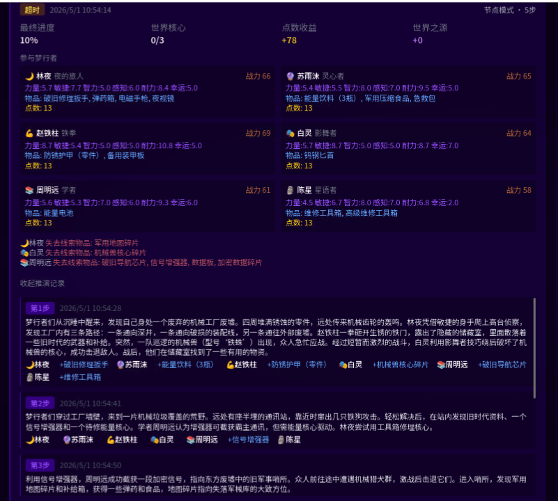
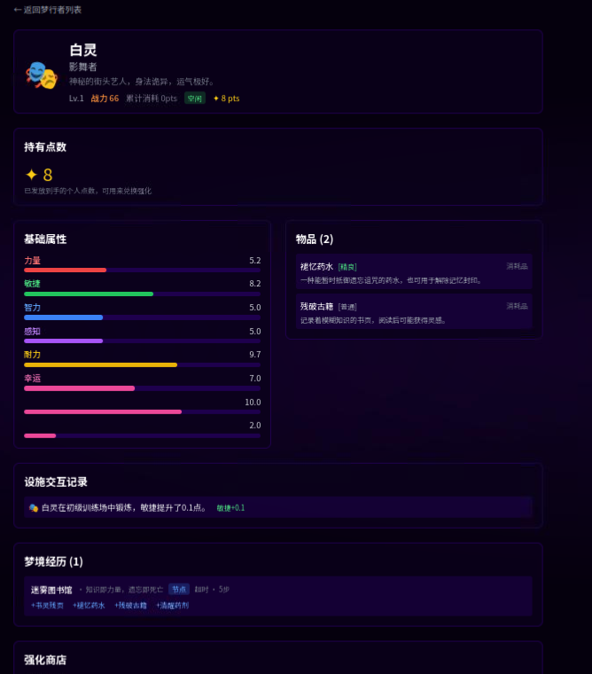
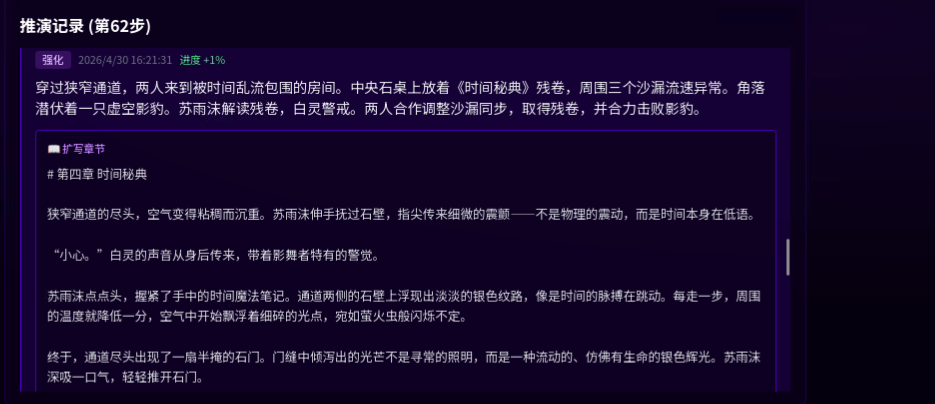
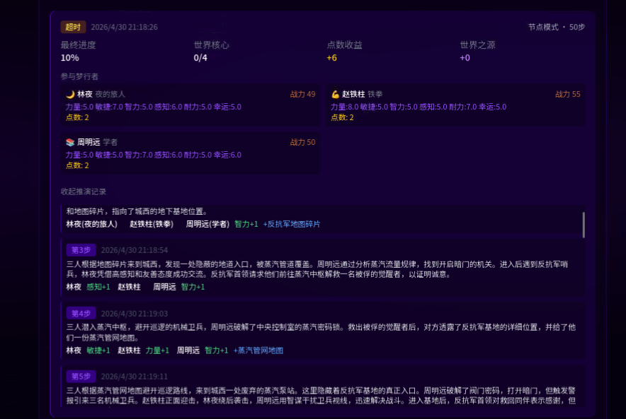
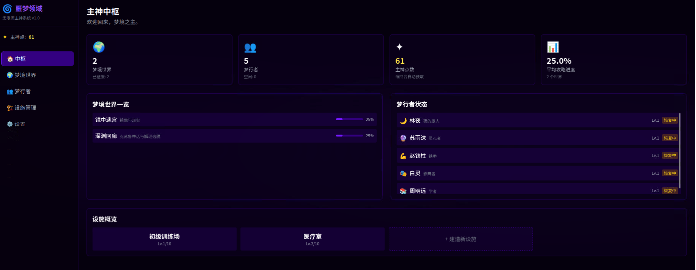
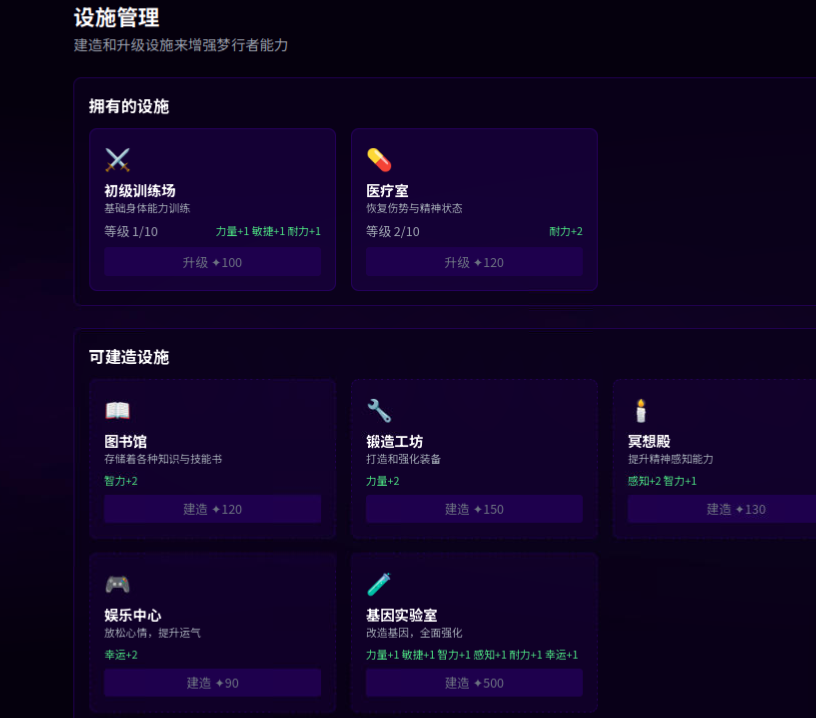
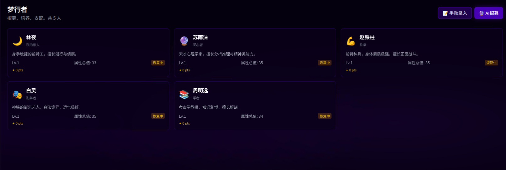
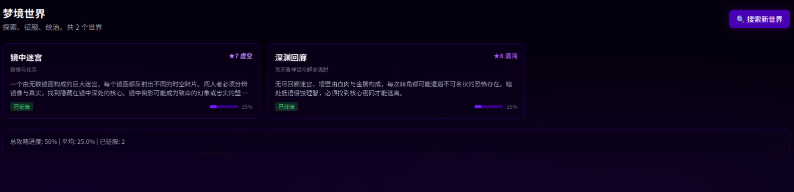
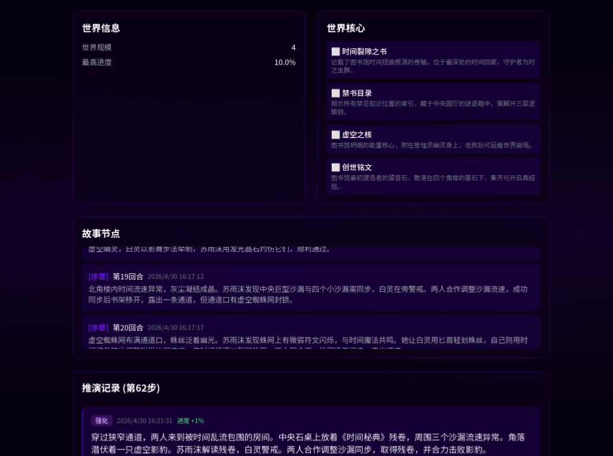
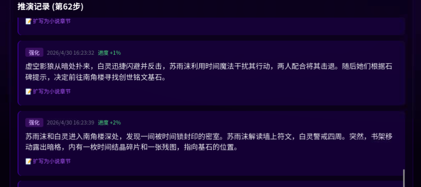

## AI使用说明
游戏用到的图片素材, 宣传图及Logo均AI生成。
游戏代码绝大部分由AI生成。

# 噩梦领域 — 玩法介绍

> **你即是主神。** 招募梦行者，征服梦境世界，构筑无限轮回的多元宇宙。

---

## 核心循环

**搜索世界 → 派遣梦行者 → 攻略 → 收获资源 → 强化 → 挑战更强世界**

每一位梦行者在梦境中的经历都由 AI 实时生成——战斗、探索、解谜、奇遇，每一回合都是独特的故事。

---

## 梦行者

他们是你在各个梦境世界中征战的棋子。每位梦行者拥有 **6 项属性**（力量、敏捷、智力、感知、耐力、幸运），以及物品、技能和等级。

- **招募**：通过 AI 随机生成或手动录入
- **成长**：在梦境中获得经验、拾取物品、学习技能
- **强化**：消耗梦行者个人点数在商店中购买属性升级和技能
- **陨落与复苏**：梦行者可能在战斗中陨落，可通过时光塔复苏

> 战力的计算公式取决于属性、等级、技能和装备的综合加权，而非简单的整数叠加。

---

## 梦境世界

每一个世界都是独立的随机生成宇宙，拥有独特的主题、世界观、核心任务和怪物生态。

| 属性 | 说明 |
|------|------|
| **难度** | 1~10，越高越危险，奖励也越丰厚 |
| **规模** | 1~5，决定世界核心数量和攻略复杂度 |
| **战力需求** | 怪物的强度评级，从 0 到上亿不等 |
| **世界核心** | 每个世界有 2~5 个核心目标，击破核心才能推进剧情 |
| **攻略进度** | 0%~100%，核心未破时进度上限锁定在 10% |

**难度梯度参考：**

| 难度 | 战力需求 | 说明 |
|------|---------|------|
| 1 | 0 | 毫无危险 |
| 2 | ~3~14 | 极低威胁 |
| 3 | ~20~100 | 新手起步区 |
| 4 | ~144~720 | 需要一定积累 |
| 5 | ~1K~5K | 步入深水区 |
| 6 | ~7K~37K | 精英级 |
| 7 | ~53K~268K | 噩梦级 |
| 8 | ~386K~1.9M | 深渊级 |
| 9 | ~2.8M~13.9M | 混沌级 |
| 10 | ~20M~100M | ？？？ |

> 搜索世界时可开启**排除危险世界**，确保生成的 world 战力不超过当前最强梦行者。

---

## 攻略模式

### 节点模式
全自动推进，适合快速攻略。AI 或机械引擎自动生成每一回合的剧情和事件，梦行者自动获得结算强化。

### 详细模式
需要配置 AI 接口。每一回合你可以：
- **发布任务**：用自然语言下达指令（如"搜索附近的水源"、"调查遗迹"）
- **不发布任务**：让 AI 自主推进
- **查看详细叙事**：每回合生成 50~120 字的剧情描述
- **获得正式任务**：AI 可将你的指令转化为带标题、描述和奖励的结构化任务

---

## 设施系统

建造和升级设施来永久性增强所有梦行者。设施每日自动训练空闲梦行者。

| 设施 | 效果 | 价格 |
|------|------|------|
| 初级训练场 | 力量+1 敏捷+1 耐力+1 | 100✦ |
| 医疗室 | 耐力+2 | 80✦ |
| 图书馆 | 智力+2 | 120✦ |
| 锻造工坊 | 力量+2 | 150✦ |
| 冥想殿 | 感知+2 智力+1 | 130✦ |
| 娱乐中心 | 幸运+2 | 90✦ |
| 基因实验室 | 全属性+1 | 500✦ |
| 时光塔 | 复苏陨落梦行者 | 2000✦ + 5💎 |
| 本源熔炉 | 每日产出本源点数 | 500✦ + 3💎 |

---

## 经济系统

三种资源各司其职：

- **使用池（✦）**：搜索世界、招募梦行者、建造设施的主要货币
- **奖励池（✦）**：任务奖励专用，可转移至使用池
- **本源点数（💎）**：建造特殊设施的稀有资源，通过本源熔炉或击破世界核心获得

每日收入：已攻略世界数量 × 10 + 1（基础），本源熔炉额外产出。

---

## 战斗与事件

梦境中的遭遇丰富多彩，不只限于战斗：

- **战斗**：面对各种怪物，胜负取决于战力、物品、技能、环境和克制关系
- **探索**：发现遗迹、解密机关、获得宝藏
- **解谜**：运用智力和感知破解谜题
- **生存**：在恶劣环境中求生
- **社交**：与梦境中的 NPC 交互
- **奇遇**：随机幸运事件

> AI 模式下，战斗并非唯战力论——合理利用道具和策略可以以弱胜强。

---

## 世界核心

每个世界藏有 2~5 个核心，是推动剧情的关键节点：

- 首个核心攻破前，攻略进度锁定在 **10%**
- 每攻破一个核心，进度大幅跃升
- 核心提供 **本源点数** 奖励
- 全部核心攻破后，世界进入决战阶段

---

## 世界观

游戏内置 20 种梦境主题，AI 可生成更多变体：

末日废土 · 克苏鲁神话 · 东方仙侠 · 赛博朋克 · 中世纪奇幻
现代都市怪谈 · 史前蛮荒 · 宇宙恐怖 · 蒸汽朋克 · 武侠江湖
未来科幻 · 神话复苏 · 丧尸围城 · 海底深渊 · 天空浮岛
时间循环 · 平行世界 · 恶魔契约 · 盗梦空间 · 轮回转世

---

## 小贴士

- 初期优先招募 3~5 名梦行者，均衡培养
- 建造训练场和医疗室快速提升基础属性
- 优先攻略难度 3 的世界积累资源
- 梦行者陨落不意味着终结——时光塔可以让他们重返战场
- 排除危险世界功能可避免遇到远超当前战力的世界
- 攻略完成后等待冷却结束，可以重置世界重新挑战

## 截图

